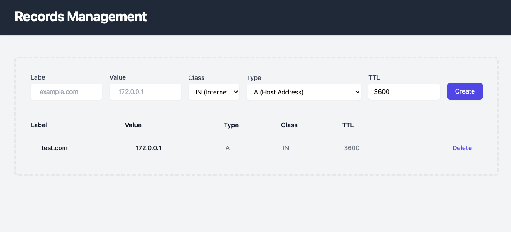
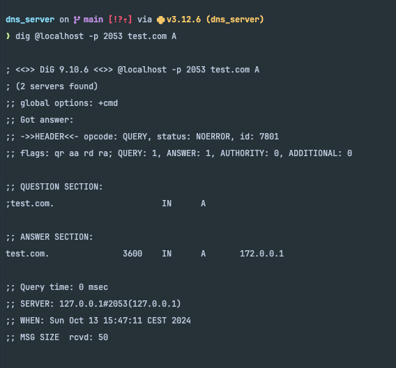

# Simple Bare Bones DNS Server

This project implements a simple DNS server using Python 3.12, SQLite, and FastAPI. It allows you to create and manage DNS records through an API.

## Features

- Basic DNS server functionality following [rfc1035](https://datatracker.ietf.org/doc/html/rfc1035)
- SQLite3 database for storing DNS records
- FastAPI + HTMX + Tailwind for creating and managing DNS records

## Requirements

- Python 3.12 or higher
- Make 3.81 or higher
- uv 0.4.10

## Installation

1. Clone the repository:
   ```
   $ git clone https://github.com/hyla96/dns_server.git
   $ cd dns_server
   ```

2. Install the required dependencies:
   ```
   $ make setup
   $ make install
   ```

## Usage

1. Start the DNS server:
   ```
   $ python main.py
   ```
   
2. Open your browser and navigate to `http://localhost:2054` to access the DNS records management interface.
3. You can test the dns with `dig` command:
   ```
   $ dig @localhost -p 2053 example.com
   ``` 

## Console Output Example

Here's an example of what you will see in the console when running the DNS server:



## Dig Example

Here's an example of using dig to query your DNS server:



## Contributing

Contributions are welcome! Please feel free to submit a Pull Request.

## License

This project is licensed under the MIT License - see the LICENSE file for details.